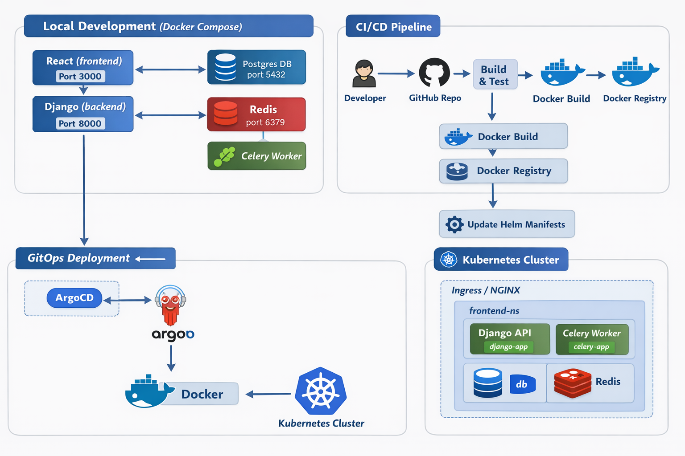

# DevOps Microservices App (Django + React + GitOps)

 A full-stack microservices application built with Python (Django) for the backend and React for the frontend. This project demonstrates DevOps best practices, including GitOps workflows, CI/CD automation, containerization, and cloud-native deployment.

An AI-powered platform that connects musicians to gigs in real-time using Generative AI and AI Agents.


---

---

## 🚀 Features

 - Microservices Architecture – Modular services for scalability and maintainability
- Backend: Django REST Framework (API-first design)
- Frontend: React with responsive UI
- Database: PostgreSQL (or update with your DB)
- CI/CD Pipelines: Automated testing & deployment (GitLab/Jenkins/GitHub Actions – specify yours)
- GitOps Workflow: Infrastructure as Code + Continuous Delivery
- Dockerized Services: Easy local development and cloud deployment
- Kubernetes Ready: Deployment manifests for orchestration

## 🏗️ Architecture

```
flowchart TD
    A[React Frontend] -->|REST API| B[Django Backend]
    B --> C[(Database)]
    B --> D[Auth Service]
    B --> E[Other Microservices]
    A --> F[NGINX/Load Balancer]

```

### Database: PostgreSQL / MySQL

### Backend
- **Django 4.2** - Web framework
- **Django REST Framework** - API framework
- **PostgreSQL** - Primary database
- **Redis** - Caching and task queue
- **Celery** - Background task processing
- **Jazzmin** - Beautiful admin interface


## 🚀 Setup & Installation

### Environment Setup
Create a `.env` file in the root directory:
```bash
# Django Settings
SECRET_KEY=your-secret-key-here
DEBUG=True
ALLOWED_HOSTS=localhost,127.0.0.1

# Database
DB_NAME=Your_DB_NAME
DB_USER=postgres
DB_PASSWORD=postgres
DB_HOST=db
DB_PORT=5432

# Redis
REDIS_URL=redis://redis:6379/0

# OpenAI (Optional for development)
OPENAI_API_KEY=your-openai-api-key
```

## Access the Application 
- Frontend → http://localhost:3000
- Backend → http://localhost:8000

### 3. Start Development Environment usig makefile
```bash
# Build and start all services
make dev
```

### 4. Access the Application
- **Frontend**: http://localhost:3000
- **Backend API**: http://localhost:8000/api/
- **Admin Interface**: http://localhost:8000/admin/
- **API Documentation**: http://localhost:8000/api/docs/

### 5. Create Superuser
```bash
make createsuperuser
```

## 📱 Available Commands

```bash
# Development
make dev              # Build and start development environment
make quick-start      # Quick start without building
make build            # Build all Docker images
make up               # Start all services
make down             # Stop all services

# Database
make migrate          # Run Django migrations
make makemigrations  # Create Django migrations

# Management
make shell            # Open backend shell
make frontend-shell   # Open frontend shell
make db-shell         # Open database shell
make logs             # Show all logs
make backend-logs     # Show backend logs
make frontend-logs    # Show frontend logs

# Maintenance
make clean            # Clean up containers and volumes
make restart          # Restart all services
make status           # Show service status
```


## 🔌 API Endpoints

### Authentication
- `POST /api/auth/register/` - User registration
- `POST /api/auth/login/` - User login
- `POST /api/auth/logout/` - User logout
- `POST /api/auth/refresh/` - Token refresh

### Profiles
- `GET /api/profile/` - User profile
- `PUT /api/profile/update/` - Update profile
- `GET /api/musician/profile/` - Musician profile
- `PUT /api/musician/profile/update/` - Update musician profile
- `GET /api/venue/profile/` - Venue profile
- `PUT /api/venue/profile/update/` - Update venue profile


## 🧪 Testing

```bash
# Run Django tests
make test

# Run frontend tests
make frontend-shell
npm test
```